# Tactic F.C. Manager (TFM 27) — stato del gioco al 24/09/2026

Questo documento racconta **tutto quello che il gioco fa oggi e come lo fa**, con le foto delle schermate vere, i
numeri di taratura e i limiti noti. Serve a decidere il prossimo aggiornamento: in fondo ci sono le proposte, con la
stima di lavoro.

- **Versione**: 0.2.0 «la partita» (installer Windows) · formato dei salvataggi **28**
- **Codice**: <https://github.com/XmarcoS10/talisman> (GPL-3.0) · **Sito**: <https://xmarcos10.github.io/talisman/>
- **Qualità**: 253 test verdi, tipi puliti, CI su ogni modifica, golden master del motore e guardia sulle prestazioni
- **Misura**: ~16.000 righe di TypeScript (motore + interfaccia), 1.805 stringhe per lingua (italiano e inglese)

---

## 1. L'idea, in una riga

> Non alleni una rosa: alleni un gruppo di persone.

Tutto il resto del gioco esiste per far funzionare questa frase: i giocatori hanno rapporti fra loro, memoria di quello
che prometti, ambizioni che il mercato può soddisfare o tradire, e tutto questo si vede **in campo**, nelle scelte del
motore partita, non solo in una schermata di umore.

## 2. Com'è fatto

| Parte | Dove | Cosa fa |
|---|---|---|
| Motore | `src/engine/` | simulazione pura: niente React, niente DOM, niente Electron, niente `node:*`. Gira anche in Node da riga di comando. |
| Laboratorio | `src/sim-cli/` | `pnpm sim`: simula stagioni, partite, mercato, sviluppo, psicologia e stampa i report di bilanciamento. |
| Interfaccia | `src/ui/` | React 19. Le stringhe stanno tutte in `it.json`, i colori solo nei token di `tokens.css`. |
| Campo 2D | `src/ui/match/` | interpolazione del registro del motore, disegno su canvas, regole dell'analista. |
| Guscio | `electron/` | finestra desktop, file dei salvataggi, registro degli errori. |
| Pipeline grafica | `tools/assets/` | `pnpm assets`: genera con ComfyUI, sceglie, post-produce, tiene le licenze. |

**Cinque regole non negoziabili** (`CLAUDE.md`): niente `any`; nel motore il caso passa solo dal generatore con seme
(`Rng`, xoshiro128\*\*) e non esistono date reali ma solo *stagione + giorno*; tutte le costanti di taratura stanno in
`src/engine/balance.ts`; i valori derivati (valore di mercato, classifica, età) si calcolano e non si salvano mai; ogni
cambio di formato del mondo alza il numero di versione e porta con sé la sua migrazione.

Conseguenza pratica: **stesso seme = stesso mondo, stessa partita, stesso campionato**. È quello che permette di
misurare il bilanciamento e di rigenerare le stesse immagini o gli stessi risultati a distanza di mesi.

---

## 3. Il mondo

Alla creazione (`newWorld`) nascono **3 campionati da 20 club** (Serie A, Serie B e una Serie C di contorno),
**1.500 giocatori**, **132 agenti** e **192 osservatori**. Nessun nome reale: club, città e persone escono da liste di nomi comuni
(`names.ts`), e il formato del mondo è pensato perché un domani l'utente carichi i propri dati.

**I club** hanno nome, città, tre colori, anno di fondazione (1890-1960), reputazione 1-100, filosofia (giovani,
veterani, fisico, tecnica, equilibrio), stadio con capienza, cassa, conto economico stagione per stagione, rate da
pagare e da incassare, sanzioni del fair play, rosa, tattica, formazione scelta, settimana di allenamento, familiarità
coi moduli, fuori rosa, osservatori, strutture e reclutamento del vivaio, faide aperte.

**I giocatori** hanno 45 attributi in quattro gruppi (13 tecnici, 17 mentali, 6 fisici, 9 da portiere: un giocatore di
movimento ne usa 36, un portiere quelli da portiere più mentali e fisici), un'abilità attuale e un potenziale, sei assi
di personalità (**ambizione, professionalità, lealtà, temperamento, socievolezza, tolleranza alla pressione**),
posizione naturale e secondarie con quanto ci stanno bene, piede, altezza, contratto, condizione, morale e rapporti,
storico di carriera, presenze in nazionale.

La qualità media della rosa nasce dalla reputazione del club: `CA medio = 48 + reputazione × 1,08`, con dispersione 13.
Le età si distribuiscono attorno a 26 anni (sigma 4,5), chi ha meno di 22 anni paga 6 punti di abilità per ogni anno
che gli manca, e dai 33 comincia a ritirarsi qualcuno.

**Una stagione** è di 38 giornate (andata e ritorno), con le partite ogni 7 giorni, le pause per le nazionali a quattro
finestre fisse, la finestra di mercato invernale a metà (giorni 175-189) e quella estiva nel cambio di stagione.

---

## 4. Il tempo che passa

Premere **Avanza** porta al prossimo impegno. Per ogni giorno che passa il motore fa, in ordine: pause delle nazionali
se le attraversa, mercato di gennaio se entra nella finestra, poi per ogni settimana intera e per ogni club
l'allenamento, la settimana dello spogliatoio, gli stipendi, la fiducia della dirigenza, il lavoro degli osservatori,
lo scanner delle storie, le domande della stampa e le mosse degli agenti. Poi si giocano le partite del giorno
(campionato e coppa), si aggiornano classifiche e statistiche, e ogni quattro giornate si segna un punto nella curva di
crescita di ogni giocatore.

A fine stagione: promozioni e retrocessioni (le ultime 3 della A scendono, le prime 3 della B salgono), albo d'oro, ritiri, rientri dai prestiti, rinnovi dell'IA,
annata del vivaio, torneo estivo negli anni pari, taglio degli ingaggi per chi sfora, **mercato estivo**, svincolati,
prestiti dei giovani, e infine la nuova stagione col calendario sorteggiato e le amichevoli di preparazione.

**Coppa nazionale**: eliminazione diretta fra tutti i 40 club, gara secca, rigori se finisce pari, turni
infrasettimanali; le 8 più blasonate entrano agli ottavi (altrimenti le grandi giocano sei partite in più e la stagione
le schiaccia). Premi: 3 milioni alla vincitrice, metà alla finalista. Le gare di coppa non entrano nelle statistiche di
campionato ma stancano e fanno male come le altre.

---

## 5. Allenamento, condizione, infortuni, crescita

**La settimana tipo** sono 12 sedute (mattina e pomeriggio per sei giorni) scelte fra tattica, fisico, tecnica,
piazzati, partitella, recupero e riposo. Ogni categoria ha un carico: il carico consuma forma fisica
(4 punti per unità), alza l'affaticamento stagionale (0,25 per unità) e nutre la crescita.

**Tre numeri diversi** descrivono lo stato di un giocatore, e servono a cose diverse:
- **Forma fisica** (0-100): quanto è in ordine adesso; si recupera 12 punti al giorno.
- **Condizione partita**: 30 punti per 90 minuti giocati, -8 a settimana senza giocare, +3 per partitella; a inizio
  stagione parte da 60 grazie alla preparazione. Sotto 100 costa precisione in campo.
- **Affaticamento stagionale**: 3,5 per 90 minuti; si smaltisce 2,2 a settimana (di più col riposo). Alto = più
  infortuni e recupero più lento.

**Infortuni**: catalogo con durata e rischio di ricaduta. In allenamento la probabilità di base è 0,0024 a settimana al
carico di riferimento (5,5) e cresce con la terza potenza del carico: strafare si paga davvero. In partita c'è
l'infortunio da fallo (2,5% dei falli) e quello senza contatto (0,6% per giocatore a partita, moltiplicato per il
rischio personale). Chi rientra resta esposto a una ricaduta per metà della durata dell'infortunio, fino a 28 giorni.

**Crescita**: ogni settimana ogni attributo può salire o scendere di 1. La probabilità di salire parte da 0,26% per
ogni 10 punti di distanza dal potenziale ed è moltiplicata dal carico giusto, dal ruolo (gli attributi chiave del ruolo
crescono 1,5×, quelli generali 1,2×, gli altri 0,6×), dalla professionalità e dall'età. Ogni macro-area ha la sua curva:
il fisico cresce fino a 20 anni e cala dai 30; la tecnica fino a 21 e cala dai 32; la testa fino a 22 e cala dai 34.
Un **mentore** over 27 accanto a un under 21 gli passa punti mentali (1,2% a settimana per attributo, scalato con
Influenza sociale) e perfino un po' del proprio carattere.

---

## 6. Le persone (il pilastro)

**Morale 1-100** con un bersaglio calcolato da: risultati contro le attese (ultime 5 partite), minutaggio rispetto a
quello che si aspetta (pesato con l'ambizione), forma personale, fiducia nell'allenatore, esclusione dalla rosa,
faide aperte. Il morale si muove verso il bersaglio più in fretta quando scende (0,25) che quando sale (0,12), e la
Resilienza personale cambia la velocità.

**Grafo sociale**: ogni coppia di compagni ha una forza di rapporto che nasce da nazionalità comune (+25), lingua
(+12), età vicina (+6), socievolezza, rivalità di ruolo (-12) e un po' di rumore. I rapporti derivano nel tempo: gli
amici si legano di più, le ruggini si ricuciono piano, due dello stesso ruolo che si contendono il posto si inaspriscono.
Ogni settimana c'è il 5% che in un club scoppi una lite; sotto -60 di rapporto nasce una **faida**, e se coinvolge un
leader (influenza 45+) pesa su tutto lo spogliatoio. Il morale è **contagioso**: il 2% dell'umore di un giocatore passa
ai suoi legami ogni settimana.

**Promesse**: prometti a un giocatore spazio da titolare (6 partite) o minuti (3), e c'è una finestra di 8 settimane.
Mantenuta, guadagni fiducia; rotta, la perdi — e il suo agente se ne ricorda al prossimo tavolo.

**Causal Log**: ogni cosa che tocca un tuo giocatore (un infortunio, una lite, una risposta in conferenza, un acquisto
nel suo ruolo, un attributo che sale) lascia una riga leggibile nella sua scheda. È il "perché" che negli altri
manageriali non si vede mai.

In campo tutto questo diventa numeri piccoli e onesti: morale (0,002 di logit per punto sopra o sotto 60), condizione
partita (0,003 per punto sotto 100), familiarità col modulo (fino a 0,15), e fra due amici il passaggio arriva l'8% più
spesso che fra due che non si parlano.

---

## 7. Il motore partita

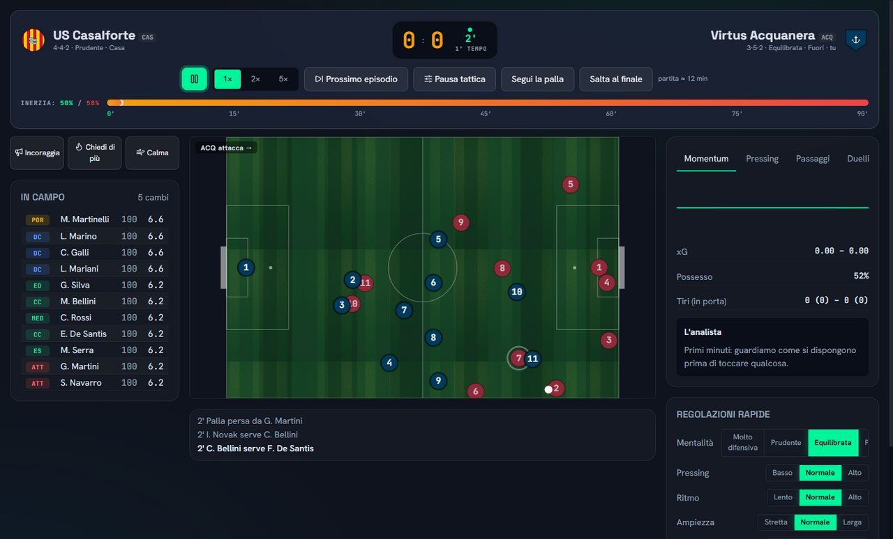

Il campo è una griglia **12 × 8 zone** (una zona ≈ 8,75 × 8,5 m). La partita è una sequenza di **azioni del portatore
di palla**; a ogni azione:

1. **Posizioni** — ognuno ha un posto ideale (modulo + ruolo + posizione della palla) e ci *corre* a velocità limitata
   (0,55 zone al secondo di media, modulata da Velocità, Accelerazione ed energia). Chi attacca sale a blocco, chi
   difende accorcia (0,75) e marca a uomo nella propria metà campo, il difensore in più esce a schermare.
2. **Pressione** — i difensori entro 1,4 zone pressano, secondo Sacrificio, energia e istruzione di pressing.
3. **Opzioni** — passaggio a ogni compagno, palla in profondità dietro la linea, dribbling, tiro, cross. Ognuna ha una
   probabilità di riuscita (sigmoide di un logit documentato: distanza, corsie chiuse, marcature, pressione, abilità) e
   un'utilità in gol attesi: `u = p · (valore dopo) − (1 − p) · (valore regalato)`, dove il valore di una posizione è
   l'*expected threat* `0,0006 · e^(0,45·x)`, ridotto verso le fasce.
4. **Scelta** — softmax con temperatura: chi ha Decisioni alte sceglie quasi sempre l'opzione migliore, chi è sotto
   pressione e ha poca Compostezza sbaglia di più.
5. **Esecuzione** — intercetti, contrasti, falli (0,3 di base, +Aggressività, meno in area), cartellini (18% di giallo
   sul fallo, 0,3% di rosso), fuorigioco, tiri, corner, cambi, stanchezza (0,22 di energia al minuto), momentum.

**Gol attesi (xG)**: `logit = −1,27 + 1,6·angolo − 0,1·distanza_m − 0,45·pressione`, con il colpo di testa a −0,9 e il
rigore fisso a 0,76. La Finalizzazione dell'attaccante e le mani del portiere spostano il risultato del 2,5% per punto.

**Stato della partita**: dal 55' chi è avanti abbassa la mentalità di un livello, dal 60' chi è sotto la alza (di due
dal 75'). Il **momentum** (gol +25, tiro +3, decadimento 0,97) dà fino a 0,15 di logit, attenuato dalla Compostezza.
La squadra di casa ha un vantaggio fisso di 0,12.

**Dalla panchina**, ogni 15 minuti puoi dare un'indicazione: *incoraggia*, *chiedi di più*, *calma*. Chi risponde bene
guadagna 0,03 di logit, chi la prende male ne perde 0,02 — dipende dalla tolleranza alla pressione, quindi chiedere di
più a chi non regge peggiora le cose.

**Cambi**: cinque, panchina da nove, l'IA cambia attorno al 58', 68' e 78' o quando l'energia scende sotto 74.

**Voti**: base 6,2 più gol, assist, passaggi chiave, tiri in porta, recuperi, dribbling, precisione, parate, porta
inviolata; meno i cartellini. La media del campionato sta a 6,65, e il 5% dei voti supera l'8.

**Il campo 2D** non è un'animazione decorativa: la schermata simula solo poco più avanti di quello che stai guardando,
così cambi e istruzioni contano davvero. Il motore emette una posizione di tutti e 22 ogni 0,25 secondi di gioco;
la riproduzione interpola fra un'azione e l'altra. L'**analista** legge gli stessi dati e commenta: inerzia, xG,
possesso, catene di passaggi, duelli, pressing.

**Simulazione istantanea**: se non vuoi guardare, la partita si calcola in un attimo con lo stesso motore e le stesse
statistiche.

---

## 8. Tattica

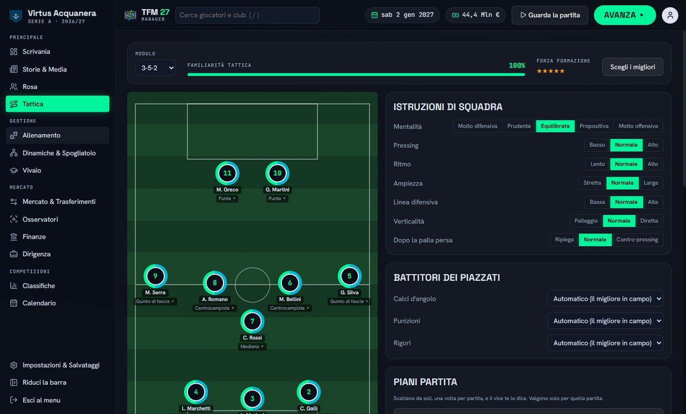

**Cinque moduli** (4-3-3, 4-4-2, 4-2-3-1, 3-5-2, 5-3-2), **27 ruoli**, mentalità da 1 (molto difensiva) a 5 (molto
offensiva) e cinque istruzioni a tre livelli: pressing, ritmo, ampiezza, linea difensiva, verticalità.

Ogni ruolo è un vettore di tendenze — quanto sale in possesso, quanto rientra, quanto si inserisce in area, quanto
tira, crossa, dribbla, pressa, quanto consuma. I ruoli di default riproducono esattamente la taratura del motore: le
differenze nascono solo dalle tue scelte. La mentalità è un compromesso onesto: più offensiva vuol dire più gol fatti e
più gol subiti (chi rientra è meno, la copertura cala di 0,15 per livello).

**Familiarità col modulo** 0-100: si impara con le sedute tattiche (1,5 a seduta, scalato dall'Adattabilità media della
rosa) e si dimentica (0,5 a settimana) per i moduli che non usi. Il modulo iniziale parte da 80, gli altri da 40. Un
modulo del tutto sconosciuto costa 0,15 di logit a ogni azione: si sente.

Chi non è disponibile viene sostituito automaticamente dal migliore per quello slot, con una notizia sulla Scrivania.

---

## 9. Mercato

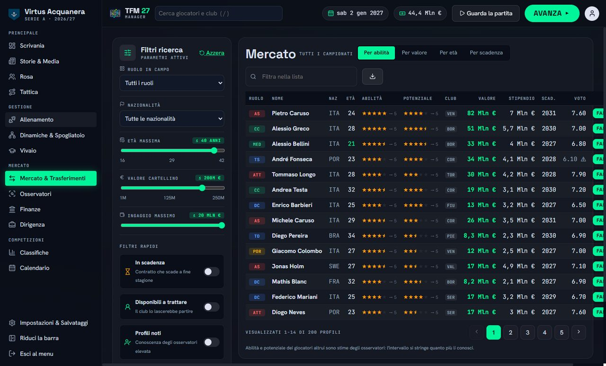

**Valore**: calcolato, mai salvato. Dipende da abilità, potenziale non ancora espresso (sotto i 24 anni), età (si paga
il picco 24-29, si svaluta dopo i 30 del 15% l'anno), contratto residuo (chi scade vale il 45%), ruolo (una punta vale
1,2 volte un pari abilità, un portiere 0,75), nazionalità della lega, reputazione del club, forma recente.

**Trattativa**: a concessioni alternate. Il venditore ha un **prezzo di riserva che non vedi mai**, parte da una
richiesta del 45% sopra il valore e scende poco per volta; la pazienza si consuma e un rilancio irrisorio la brucia.
Sul tavolo ci sono contanti, rate (ogni anno di dilazione sconta il 7%), bonus presenze e gol (valgono il 45%: si
incassano forse), percentuale sulla rivendita, contropartite tecniche, prestito con diritto o obbligo di riscatto.
Servono **due sì**: quello del club e quello del giocatore sullo stipendio.

**Agenti** (86 nel mondo): hanno personalità, commissione e **memoria per club**. Propongono assistiti, chiedono
rinnovi, spingono per uscire. Trattali male e te lo ricordano.

**Contratti**: durata 5 anni sotto i 24, 4 nel picco, 2 sopra i 31. Un quarto dei contratti ha una clausola
rescissoria (2,2 volte il valore). Un giocatore accetta se gli offri almeno il 92% di quello che chiede, meno uno
sconto per la lealtà (fino al 20%), ma un ambizioso vuole anche un club all'altezza. Sotto 40 di morale non rinnova
comunque. Da gennaio si firma a **parametro zero** per la stagione dopo, e chi arriva gratis chiede il 15% in più di
stipendio.

**Prestiti**: fino a 21 anni, se ha almeno due davanti nel ruolo e il club ospite è un gradino sotto, con minuti
garantiti (45) e riscatto pattuito.

**L'IA dei club** fa un piano per finestra: guarda i buchi della rosa (quanti mancano e quanto sono sotto il livello
del club), quanto può spendere (45% della cassa) e quanto spazio ha nel monte ingaggi (70% del fatturato), poi prova
fino a 5 acquisti scegliendo per abilità, gusto della filosofia e disponibilità del venditore.

**Le offerte per i tuoi giocatori** (novità): un club IA non compra mai da te di nascosto. Ti manda un'offerta che
trovi sulla Scrivania, con cifra, stipendio proposto e scadenza (10 giorni). Puoi **accettare**, **rifiutare** o fare
una **controproposta**: se la cifra sta entro il loro massimo l'affare si chiude, se la supera di poco rilanciano una
volta sola, se esageri si ritirano. E se il giocatore sognava quel club (12 punti di reputazione in più del tuo, e lui
ambizioso), dirgli di no gli costa 12 di morale e 10 di fiducia in te — e lo scrive nel suo Causal Log.

---

## 10. Osservatori e informazione imperfetta

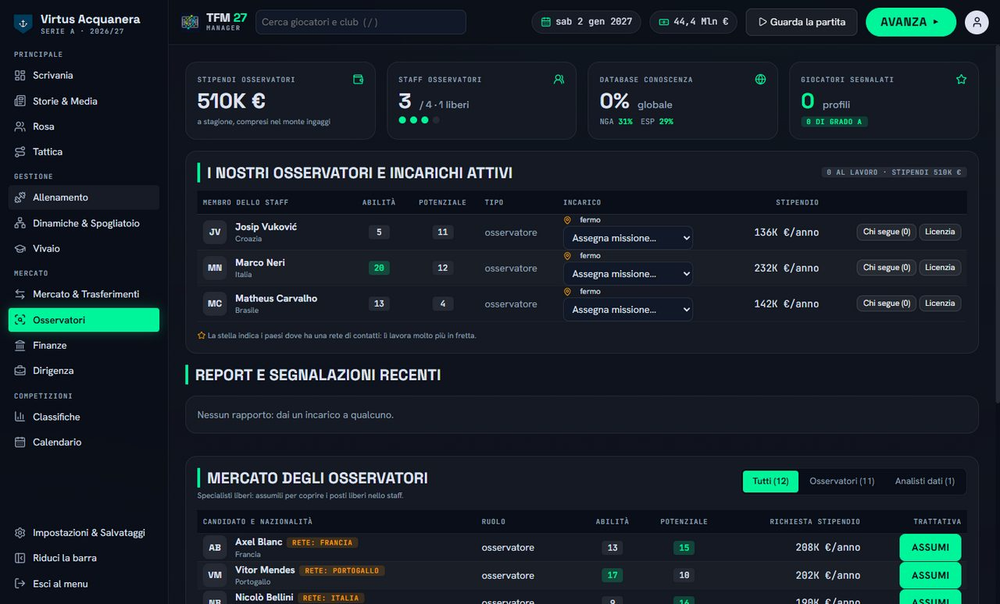

**Regola di ferro: dei giocatori che non sono tuoi non vedi mai un numero vero.** Vedi stime con una banda di
incertezza, deterministiche (riaprire la scheda non ti fa "tirare a indovinare" meglio).

Quello che si sa gratis dipende da reputazione del club e presenze in carriera, e senza osservatori non si supera mai
una conoscenza di 62 su 100. Con conoscenza zero la banda è ±22 sull'abilità e ±40 sul potenziale, e metà dell'errore è
**sistematico dell'osservatore**: uno che sopravvaluta i fisici lo farà sempre.

Hai 4 posti nello staff (uno in più si chiede alla dirigenza). Un osservatore guadagna 2,2 punti di conoscenza a
settimana sui giocatori che segue (fino a 6), più il suo Giudizio e la rete di contatti nella nazione; un analista dati
cresce più piano ma su venti giocatori insieme. Manda un rapporto quando arriva a 45 di conoscenza, e poi ogni 25 punti.
Da 55 in su capisci che tipo è (personalità); sotto le 12 presenze le medie per 90 minuti non dicono niente.

---

## 11. Finanze

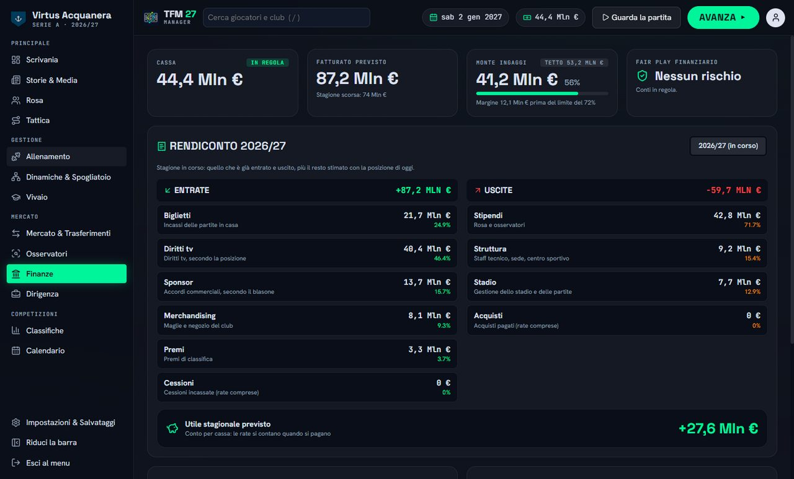

Conto **per cassa**: niente ammortamenti, le rate sono rate.

**Entrate**: biglietti (24 € a spettatore in Serie A, riempimento 62% di base che sale col rendimento e col blasone
dell'avversario), diritti tv a fine stagione (48 milioni al primo in A, 7 in B, con il 55% all'ultima), sponsor e
merchandising proporzionali al **quadrato** della reputazione, premi di posizione, premi di coppa, cessioni.

**Uscite**: stipendi ogni settimana, staff (12% del fatturato), stadio (10%), acquisti e rate.

**Fair play finanziario** progressivo: se il monte ingaggi supera il 72% del fatturato, o la cassa scende sotto il
-35% del fatturato, scatta il richiamo; poi il blocco del mercato; poi -4 punti in classifica. Chi sfora taglia gli
ingaggi lasciando andare i più pagati fra i non indispensabili, e chi ha la cassa a picco vende per forza.

La schermata mostra i riquadri del momento, il conto stagione per stagione (quella in corso è una **proiezione**), le
rate da pagare e da incassare con la scadenza, e la **cassa mese per mese**.

---

## 12. Dirigenza

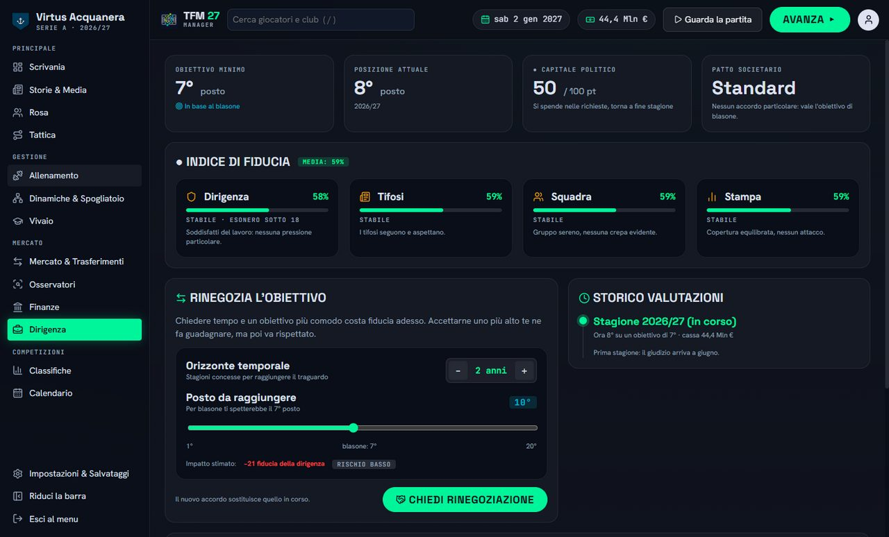

Quattro barre: **dirigenza, tifosi, stampa, squadra**. Le prime tre seguono lo scarto fra la posizione in classifica e
quella attesa (2,2 · 1,8 · 1,5 punti per posizione), con le ultime cinque partite che pesano di più per tifosi e stampa;
la quarta segue il morale dello spogliatoio. Tutte si muovono piano (25% verso il bersaglio a settimana): la fiducia ha
memoria.

**L'obiettivo è un contratto, non un umore**: puoi chiedere fino a 3 stagioni di transizione, e ogni stagione chiesta
costa 6 di fiducia subito, mentre accettare un obiettivo più alto te ne restituisce 3 per posizione. Dentro un contratto
di transizione un anno storto conta la metà.

**Capitale politico** (50 all'inizio, +20 a stagione): le richieste costano — budget 25 (sblocca il 25% della cassa),
strutture del vivaio 35, permesso di vendere 15, un posto in più fra gli osservatori 20 (fino a 8).

Sotto 18 di fiducia della dirigenza a fine stagione **sei esonerato**; sotto 32 arriva l'avviso.

---

## 13. Vivaio e nazionali

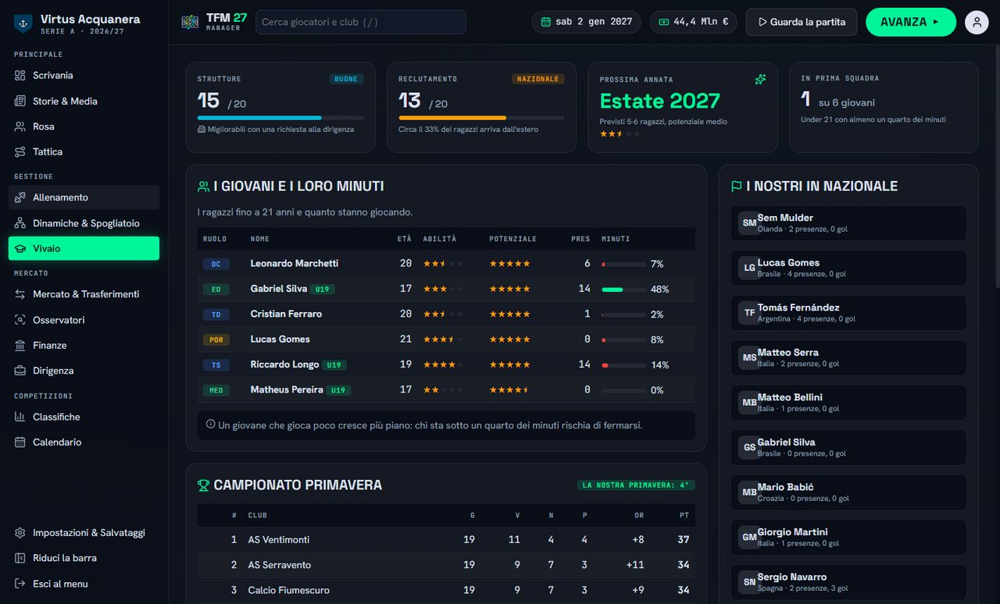

Ogni estate arriva un'annata: 3 ragazzi di base più uno ogni 7 punti di reclutamento, di 15-16 anni. Il potenziale medio
è `70 + 2,2 × strutture + 0,35 × reputazione` (≈138 in un grande club, ≈98 in uno piccolo), con l'1,2% di probabilità
del **colpo di fortuna**: un potenziale da campione (172-192) anche nel club più piccolo. Strutture e reclutamento si
alzano chiedendo investimenti alla dirigenza.

Il **campionato Primavera** esiste ma non si salva: ogni risultato nasce da un seme fisso e dalla forza del vivaio, così
è sempre lo stesso senza occupare spazio nel salvataggio.

**Nazionali**: il ct convoca 23 giocatori (i migliori della sua nazione fra chi ha una squadra e sta bene), e nelle
quattro pause si giocano **due partite vere, col motore del gioco**: formazione scelta sui convocati, chi è più debole
si chiude e chi è più forte spinge, cambi, cartellini, infortuni. Ogni gol ha un nome e un minuto, le presenze sono
quelle effettive, la fatica è quella dei minuti giocati. Le partite delle nazionali **non entrano nelle statistiche di
campionato**: restano in un archivio a parte (le ultime 60), che la schermata mostra.

D'estate si gioca l'**Europeo** negli anni divisibili per quattro e il **Mondiale** due anni dopo: gironi da quattro,
poi eliminazione diretta, rigori se finisce pari. Presenze e titoli in nazionale alzano il valore di mercato (fino al
15% per le presenze, 5% per un titolo).

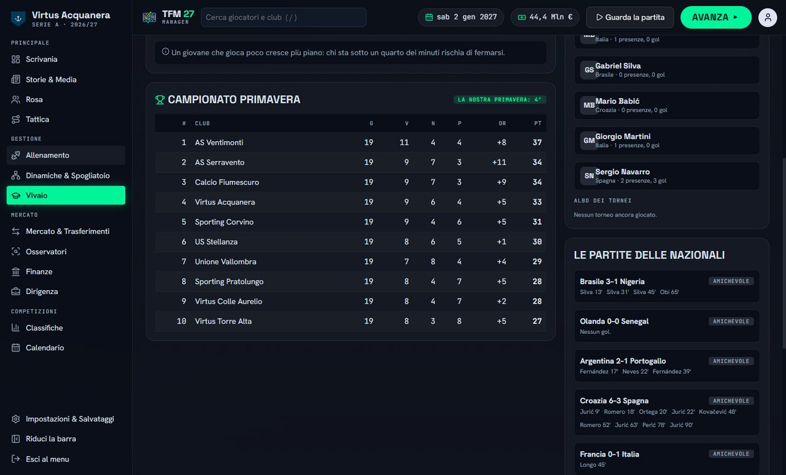

Una nazionale non è un club del mondo: la sua squadra si costruisce al momento (modulo scelto dal ct sui convocati,
modulo conosciuto al 75%) e non si salva. Le partite sono più aperte di quelle di club — 3,9 gol contro 2,5 — perché in
questo mondo il talento è concentrato in una nazione sola e i divari fra nazionali sono enormi.

---

## 14. Storie e stampa

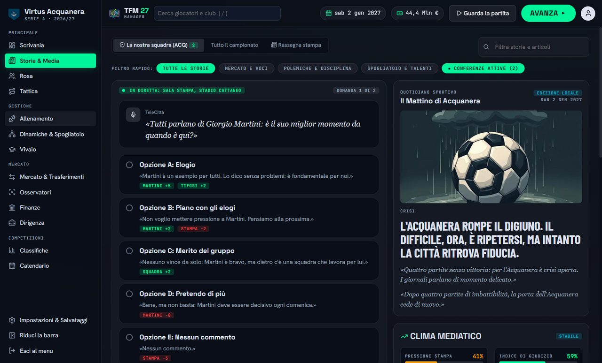

**40 archetipi di storia** (20 sui club, 20 sui giocatori) nascono da quello che succede davvero: crisi, serie utili,
imbattibilità, corsa al titolo, lotta salvezza, sorpresa, fortino in casa, maledizione in trasferta, digiuno di gol,
difesa colabrodo, bestia nera, vendetta, rimonta, sfida diretta, goleada, fair play finanziario, malumore della
dirigenza, tifosi; e poi rinascite, stati di grazia, predestinati, portafortuna, corsa al capocannoniere, portieri,
rientri, crisi personali, chi vuole andarsene, faide, mentori, esordi, veterani, colpi di mercato, flop, ex, triplette,
teste calde, firme a parametro zero, gol al 90'.

Ogni storia ha regole precise: quando nasce, come avanza, quanto vive, ogni quanto può ripresentarsi. I testi escono da
**template a grammatica italiana** (niente modelli linguistici a runtime: costo zero e funziona offline), con articoli e
preposizioni corretti per ogni nome di squadra — «della Vignarola», non «del Vignarola».

**Le conferenze stampa** fanno fino a tre domande, una per ciascuna delle storie aperte più recenti che ti riguardano (con due storie, due domande), mai a caso. Ogni risposta **dichiara i suoi
effetti prima che tu scelga**: difendere un giocatore gli dà +6 di morale, elogiarlo +5, pungolarlo +4 se regge la
pressione ma -8 se non la regge (la soglia è 13 di Tolleranza), le risposte sul gruppo muovono tutta la rosa di ±2/4, e
ogni risposta sposta di 4 una barra fra dirigenza, tifosi e stampa. Il «no comment» costa 3 alla stampa.

Il giornale della città mette in prima pagina la storia del momento con la sua illustrazione, e sotto ci sono il clima
mediatico e la cronaca della lega.

---

## 15. Le schermate, una per una

### Avvio e nuova carriera

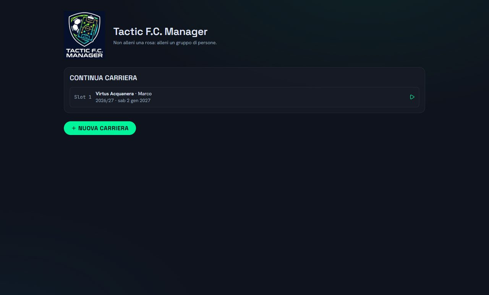

Menu con «continua» e «nuova carriera». La creazione è in due passi: prima **il club**, a schede con filtri per
campionato, obiettivo, ricerca e ordinamento; poi il **dossier** (bilancio, strutture, perni della rosa, moduli adatti),
il tuo nome e la **filosofia dell'allenatore**: gestore (+4 al morale di tutti), tattico (moduli imparati il 30% più in
fretta) o scopritore di talenti (under 21 che crescono il 15% di più).

### Scrivania

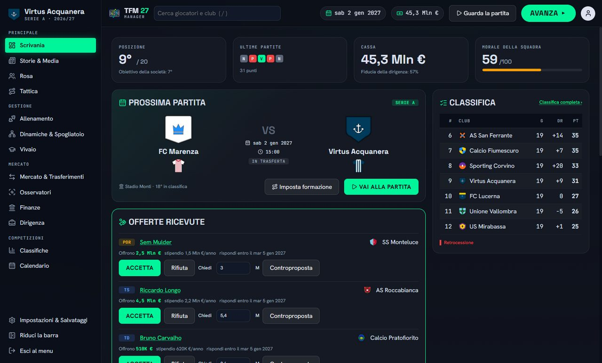

Quattro riquadri (posizione e obiettivo, forma e punti, cassa e fiducia, morale), la prossima partita con stemmi,
maglie, stadio, orario e i due pulsanti che servono («Imposta formazione», «Vai alla partita»), le **offerte ricevute**,
la guida della prima stagione, le notizie del giorno e la mini classifica con le zone. Ogni schermata ha il suo sfondo,
sotto un velo scuro.

### Rosa

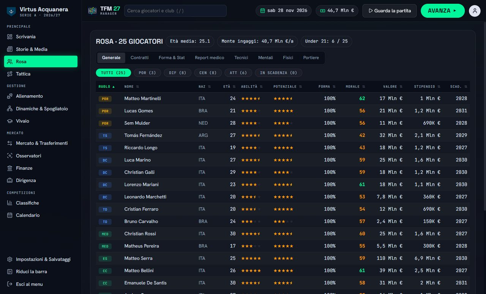

Tabella ordinabile con ruolo, nazionalità, età, abilità e potenziale a stelle (relative al tuo campionato: 5 stelle = il 3% più forte), forma, morale, valore, stipendio,
scadenza. Schede per **contratti**, **forma e statistiche**, **report medico**, **tecnici**, **mentali**, **fisici**,
**portiere**; filtri per reparto e per «in scadenza»; in alto età media, monte ingaggi e quanti under 21.

### Allenamento

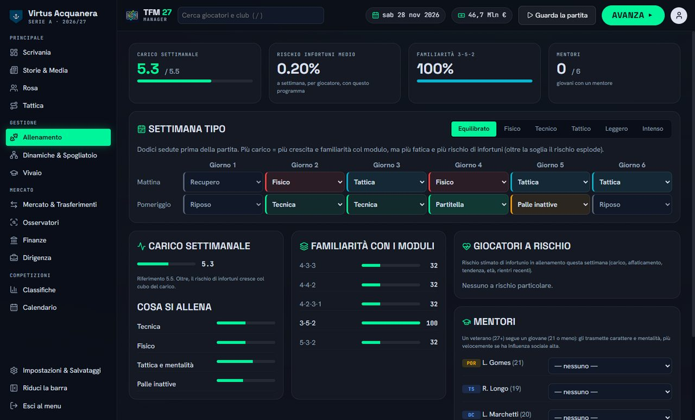

Le 12 sedute della settimana, il carico che ne risulta, chi rischia con quel carico, la familiarità coi moduli, i
mentori attivi e chi sta crescendo.

### Dinamiche e spogliatoio

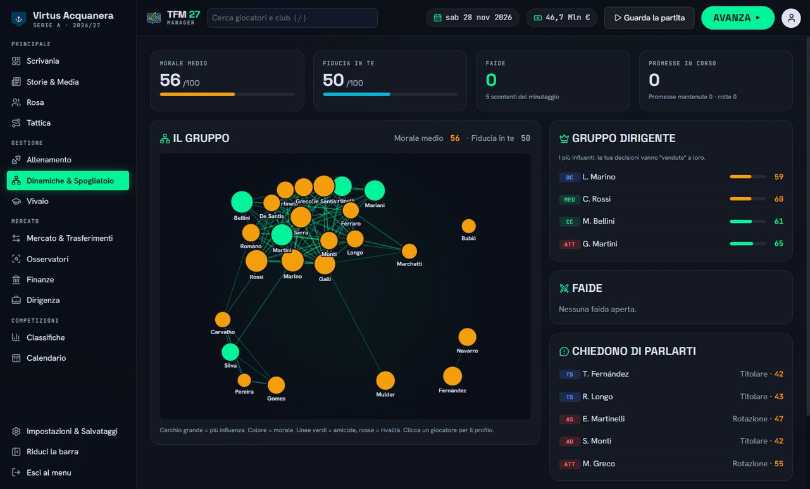

Il grafo dei rapporti (chi comanda, chi è isolato, chi litiga con chi), i leader, le faide aperte con le due strade per
chiuderle, le promesse in corso e il morale di ognuno con il «perché».

### Scheda giocatore

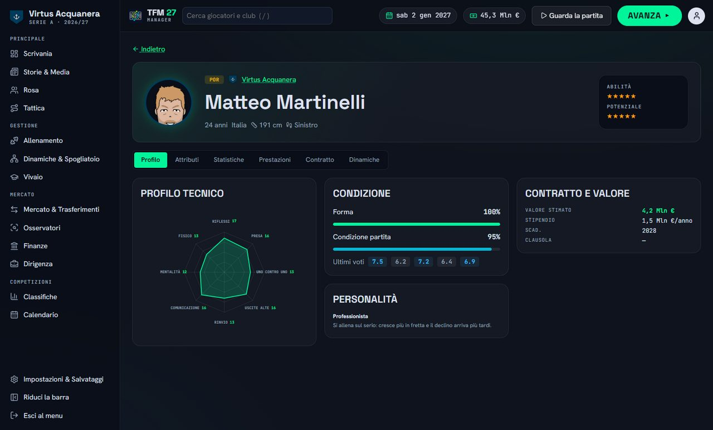

Intestazione con volto generato, ruolo, club, età, altezza, piede, abilità e potenziale; poi sei schede: **profilo**
(radar a otto assi, condizione, personalità, valore), **attributi**, **statistiche**, **prestazioni** (voti recenti e
curva di crescita), **contratto** (rinnovo, clausola, prestito) e **dinamiche** (umore, rapporti, Causal Log). Dei
giocatori altrui, sempre e solo stime.

### Classifiche e calendario

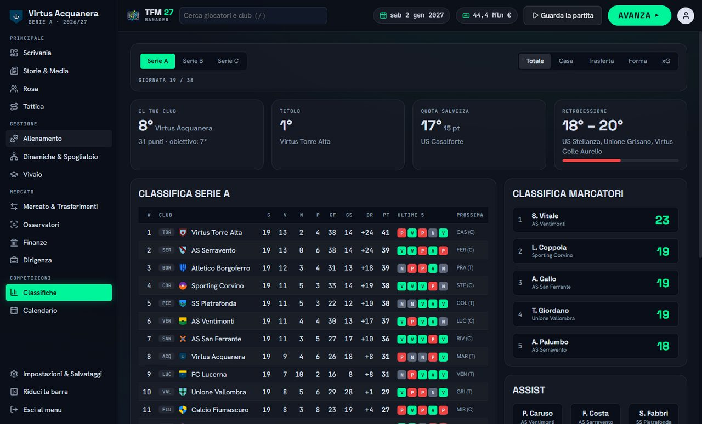
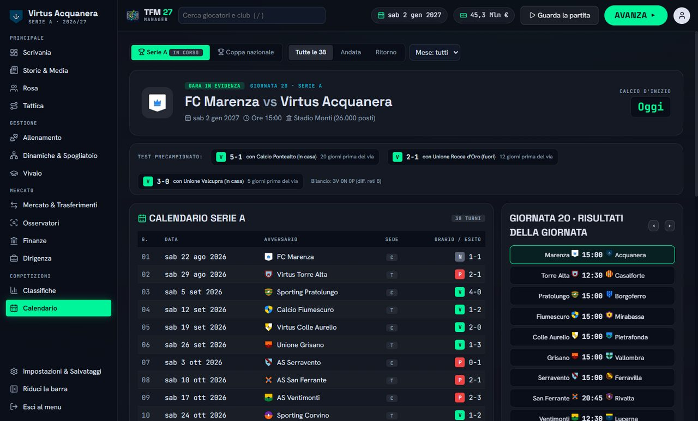

Classifica completa con viste **casa, trasferta, forma, xG**, zone colorate, marcatori, assist, medie voto, disciplina,
rigori. Il calendario ha la gara in evidenza, gli orari, le rivalità, andata e ritorno per mesi, i risultati di
giornata, la scheda della **Coppa nazionale**, i **test precampionato** e il **report sull'avversario** con il
consiglio dell'analista; si esporta anche in formato iCal.

### Impostazioni e salvataggi

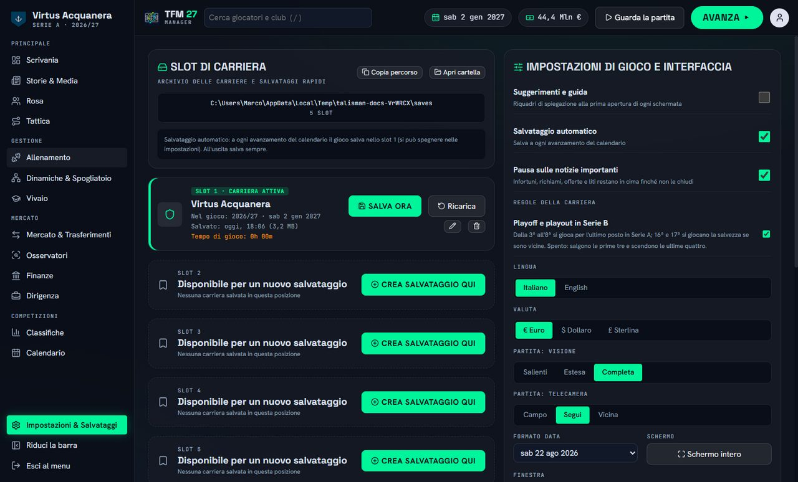

Cinque slot con nome, peso e tempo di gioco; esportazione e importazione della carriera in un file; apertura della
cartella; controllo di integrità del mondo; e le impostazioni: dodici suggerimenti contestuali, valuta, formato data, schermo intero,
misura della finestra, pausa sulle notizie importanti, salvataggio automatico, volumi separati per interfaccia, folla
ed effetti, silenzio quando la finestra non è in primo piano, esportazione della diagnostica.

---

## 16. Salvataggi, dati, diagnostica

Nell'app desktop ogni slot è un file in `%APPDATA%/talisman/saves`, con un'intestazione leggera davanti al mondo (così
l'elenco degli slot non legge 100 MB per mostrarsi). Nel browser resta il `localStorage`. Il salvataggio automatico
scatta a ogni avanzamento e all'uscita.

**Migrazioni**: 20 versioni di formato, ognuna con la sua conversione. Un salvataggio della prima versione si apre
ancora oggi. Il **controllo di integrità** verifica che ogni riferimento punti a qualcosa che esiste prima di caricare.

Il registro degli errori sta in `%APPDATA%/talisman/logs`, e «Esporta diagnostica» crea un file con versioni ed errori
recenti — che decidi tu se mandare a qualcuno. **Il gioco non si collega a internet.**

---

## 17. La grafica

**Procedurale e deterministica** (niente immagini da distribuire, tutto nasce dai dati):
- **Stemmi**: 8 scudi × 12 partizioni × 10 simboli = 960 combinazioni, assegnate da una biiezione sull'id — fino a 960
  club non esistono due stemmi uguali. Il contrasto fra campo e simbolo è garantito (WCAG); sopra i 96 px compare
  l'anno di fondazione, e i club nati prima del 1920 hanno un filetto doppio.
- **Maglie**: 15 disegni × 3 colletti × 2 tipi di manica; prima e seconda maglia; in partita l'ospite cambia maglia se
  i colori si confondono.
- **Volti**: generati con `facesjs` a partire da id, nazionalità, età e altezza. Con gli anni arrivano rughe e capelli
  grigi; la maglia è quella del club.

**Generata con l'IA in locale** (ComfyUI + FLUX.1-dev sulla RTX 3060), passando dalla pipeline `pnpm assets`: 162
immagini prodotte, 54 tenute — 12 sfondi (uno per schermata), 40 illustrazioni (una per tipo di storia), 2 texture.
La pipeline genera con seed ripetibili, fa il provino numerato, sposta i colori verso la palette del gioco in spazio
LAB tenendo la luminanza, ritaglia sul soggetto, produce WebP @1x/@2x più PNG, scrive il manifest tipizzato per
l'interfaccia, aggiorna il registro delle licenze e controlla pesi ed EXIF.

---

## 18. Qualità, bilanciamento, prestazioni

**253 test** in 37 file: motore partita (compreso un **golden master** che dice subito se una modifica cambia le
partite, e un test di struttura che fa fallire la build se una funzione del motore supera le 80 righe), mondo,
salvataggi e 28 migrazioni, mercato, contratti, agenti, offerte, finanze, dirigenza, psicologia, sviluppo, narrativa,
grammatica italiana e inglese, coppa, playoff, bancarotte, vivaio, nazionali, riproduzione e sovrapposizioni del campo
2D, piani partita, chiavi dei testi nelle due lingue, stemmi, maglie, volti, pipeline degli asset. Ogni modifica passa
dalla CI (tipi + test su Linux).

**Bilanciamento** (`pnpm sim -- --seasons 10 --seed 42`, 26/09/2026):

| Metrica | Target | Valore |
|---|---|---|
| Gol per partita | 2,5 – 2,9 | 2,51 ✅ |
| Vittorie in casa | 42 – 46% | 42,8% ✅ |
| Pareggi | 22 – 30% | 23,8% ✅ |
| Tiri per squadra | 10 – 15 | 13,2 ✅ |
| Correlazione forza ↔ punti | 0,75 – 0,85 | 0,87 sul seme 42 ⚠️, 0,80 e 0,82 sui semi 7 e 99 (il seme sposta ±0,03) |
| Campioni diversi in 10 stagioni | ≥ 4 | 5 ✅ |
| Infortuni per squadra/stagione | 12 – 18 | 13,7 ✅ |
| Gol per partita delle nazionali | ~2,9 | 3,9 ⚠️ (divari enormi fra nazionali in questo mondo) |
| 10.000 partite simulate | < 20 s | 6,5 s ✅ |
| Motore su un thread (`pnpm bench`) | ≤ 4,2 ms a partita | 3,85 ms ✅ |
| Avanzamento di un giorno (interfaccia) | < 400 ms | ~150 ms ✅ |

**Carriere da 25 stagioni** (`pnpm sim -- --career 25`, tre semi): correlazione media 0,79 / 0,77 / 0,80 ✅, i 60
migliori crescono di 1,3-2 punti in 25 stagioni (prima si gonfiavano di 13), 1,6-2 bancarotte ogni 10 stagioni ✅,
i conti dei club restano fra 50 e 60 milioni invece di salire a 400. Resta fuori bersaglio il **distacco fra Serie A e
Serie B** nelle prime 5-10 stagioni (`docs/balance/2026-09-26.md`).

**Prestazioni**: un salvataggio da 100 MB si legge in 0,5 s e si scrive in 0,7 s; una stagione simulata da riga di
comando richiede ~7 s; la giornata gira in un thread a parte, quindi l'interfaccia non si blocca mai.

---

## 19. Distribuzione

Installer Windows NSIS (123 MB, si installa nella cartella utente, senza permessi di amministratore, aggiornamento
automatico spento), versione Linux AppImage configurata ma da costruire su Linux. Il **sito** è in italiano e in
inglese, si pubblica da solo a ogni modifica con GitHub Pages, e il pulsante di download punta sempre all'ultima
versione. Note di rilascio nelle due lingue, testo pronto per itch.io (`docs/itch.md`), storyboard del video
(`docs/trailer.md`), istruzioni per i collaudatori (`docs/collaudo.md`). Licenze di tutto quello che usiamo e non
abbiamo scritto in `assets/LICENSES.md`, immagini generate comprese (modello, seed, data).

---

## 20. Cosa manca, oggi

### Tocca a Marco (non è codice)

1. **Collaudo esterno**: tre persone, una stagione intera, senza chiedere aiuto. È il criterio di «fatto» della fase 9.
2. **Pagina itch.io** e **annuncio**: testi pronti, pubblicazione dal suo account.
3. **Video**: storyboard e clip pronti, registrazione e montaggio no.
4. **Firma dell'installer**: serve un certificato a pagamento.
5. **Versione Linux**: va costruita su un computer Linux.

### Limiti noti del gioco

1. **Partite delle nazionali in diretta**: si giocano col motore vero e se ne vedono risultati e marcatori, ma non si
   seguono sul campo 2D (la diretta è legata al club dell'utente).
2. **Gol delle nazionali**: 3,9 a partita contro i 2,5 dei club, perché il mondo concentra il talento in una nazione.
   Si sistema nella generazione del mondo, dando più peso alle altre nazioni.
3. **Distacco Serie A – Serie B**: oscilla nelle prime 5-10 stagioni prima di assestarsi attorno a 24 punti di forza.
4. **Installer non firmato**: Windows mostra «editore sconosciuto».

### Debito tecnico aperto (`docs/tech-debt.md`)

Nessun test sull'interfaccia (il motore è coperto, le schermate no); `App.tsx` è il crocevia di tutto e andrebbe
spezzato; la suite completa impiega ~4 minuti; `balance.ts` e `world.ts` stanno crescendo.

---

## 21. Proposte per il prossimo aggiornamento

Tre strade, con la stima di lavoro. Si possono mescolare.

### A — «Un mondo più largo» (contenuti, ~2 settimane)

Coppe europee semplificate fra i club, altre nazioni con vivai propri (che risolve anche i gol delle nazionali),
editor del mondo nel gioco (rinominare club e giocatori, cambiare colori, stemmi), import di un database della
community.
**Perché**: allunga la vita di una carriera e apre la porta a chi vuole i nomi veri.

### B — «Il gioco si spiega» (rifinitura e fiducia, ~1 settimana)

Test di montaggio sulle schermate principali, tutorial rivisto sui punti che i collaudatori sbagliano, statistiche
storiche di carriera (albo d'oro, record personali), esportazione in CSV.
**Perché**: è la strada giusta subito dopo il collaudo esterno, quando si sa cosa non si capisce.

### C — «La panchina viva» (profondità di gioco, ~1-2 settimane)

Allenatori dell'IA con carriera e reputazione (esoneri, panchine che cambiano), arbitri con personalità, meteo e
terreno, cronaca radiofonica testuale delle partite che non guardi.
**Perché**: dà al mondo attorno alla tua squadra la stessa cura che oggi ha la tua squadra.

### Prima di tutto, comunque

- **Collaudo esterno** con tre persone e una stagione intera.
- **Pubblicare la 0.2.1** con le nazionali giocate dal motore e le correzioni che il collaudo farà uscire.

---

*Aggiornato il 26/09/2026. Le foto sono della versione di oggi, scattate dal gioco vero con*
`node tools/docs-world.ts && pnpm build && npx electron tools/shots-docs.cjs`.
